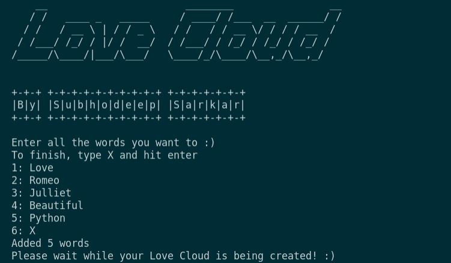

# **Love Cloud**
## *by Subhodeep Sarkar*
This project will let you create word-clouds for your loved ones like a PIECE OF CAKE!

### How to start?
1. Run "pip3 install -r requirements.txt".
2. Run "python3 main.py"
3. Enjoy ;)

### How to use?

### This is how it would look like once finished!

